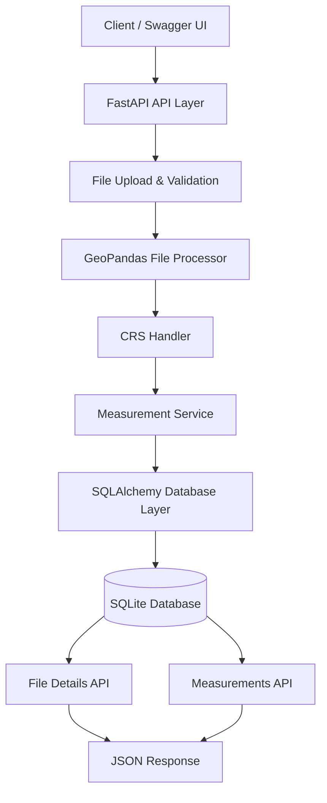

# Geospatial File Measurement API

A backend REST API built with FastAPI that accepts geospatial files in KML and zipped Shapefile formats, processes their features, calculates polygon areas and line lengths, and stores the results in a SQLite database.

## Features

- Upload KML files (`.kml`) and zipped Shapefiles (`.zip`).
- Extract feature geometry, geometry type, and attributes.
- Calculate polygon area in square meters.
- Calculate LineString length in meters.
- Handle Point geometries without measurements.
- Transform geographic coordinates to a projected CRS before measuring.
- Store file metadata, feature details, and measurements in SQLite.
- Retrieve file information and feature measurements through REST APIs.
- Return clear errors for unsupported file types, invalid uploads, missing CRS, and unknown file IDs.
- Include automated tests for measurements, CRS handling, and API errors.

## Technology Stack

- **Python** — backend programming
- **FastAPI** — REST API framework
- **GeoPandas** — geospatial file processing
- **Shapely** — geometry operations
- **PyProj** — coordinate reference system support
- **SQLAlchemy** — database interaction
- **SQLite** — database storage
- **Pytest** — automated testing

## Project Structure

```text
geospatial-file-measurement-api/
├── app/
│   ├── main.py
│   ├── api/
│   │   └── routes.py
│   ├── database/
│   │   ├── database.py
│   │   └── models.py
│   ├── schemas/
│   └── services/
│       ├── file_processor.py
│       ├── measurement.py
│       └── crs_handler.py
├── sample_data/
│   └── sample.kml
├── storage/
│   ├── uploads/
│   └── extracted/
├── tests/
│   ├── test_upload.py
│   ├── test_measurements.py
│   └── test_crs.py
├── requirements.txt
├── .gitignore
└── README.md
```

## Setup and Local Run

### 1. Clone the repository

```bash
git clone <YOUR_GITHUB_REPOSITORY_URL>
cd geospatial-file-measurement-api
```

### 2. Create and activate a virtual environment

Windows PowerShell:

```powershell
python -m venv venv
.\venv\Scripts\Activate.ps1
```

### 3. Install dependencies

```powershell
python -m pip install -r requirements.txt
```

### 4. Start the API server

```powershell
python -m uvicorn app.main:app --reload
```

The API will be available at:

`http://127.0.0.1:8000`

Interactive API documentation:

`http://127.0.0.1:8000/docs`

## API Documentation

### 1. Upload a geospatial file

**Endpoint:** `POST /api/files/`

**Request:** Multipart form data with a field named `file`.

Supported formats:
- `.kml`
- `.zip` containing a valid Shapefile

**Example response:**

```json
{
  "id": 1,
  "filename": "sample.kml",
  "feature_count": 3,
  "original_crs": "EPSG:4326",
  "measurement_crs": "EPSG:32644",
  "status": "COMPLETED"
}
```

The returned file ID can be used in the following endpoints.

### 2. Retrieve file information

**Endpoint:** `GET /api/files/{id}`

Returns the file's metadata, feature count, coordinate reference systems, processing status, and creation time.

### 3. Retrieve feature measurements

**Endpoint:** `GET /api/files/{id}/measurements/`

**Example response:**

```json
{
  "file_id": 1,
  "measurements": [
    {
      "feature_id": 0,
      "geometry_type": "Point",
      "area_sq_m": null,
      "length_m": null
    },
    {
      "feature_id": 1,
      "geometry_type": "LineString",
      "area_sq_m": null,
      "length_m": 1534.6653932844883
    },
    {
      "feature_id": 2,
      "geometry_type": "Polygon",
      "area_sq_m": 1176595.1033302273,
      "length_m": null
    }
  ]
}
```

The numeric values above are sample results from the included KML demonstration data.

### Error Responses

- `400 Bad Request` — unsupported extension or invalid geospatial file.
- `404 Not Found` — requested file ID does not exist.

## Architecture

The application separates API routes, geospatial processing, measurement logic, CRS handling, and database operations.

- **API layer:** receives requests and returns responses.
- **File processing service:** reads uploaded geospatial data and processes its features.
- **Measurement service:** calculates area or length according to geometry type.
- **CRS handler:** transforms geometries to a projected coordinate reference system for measurement.
- **Database layer:** stores file metadata and individual feature results.

- 


## Processing Flow

1. Receive a KML file or zipped Shapefile.
2. Validate the uploaded file extension.
3. Save the uploaded file.
4. Read the geospatial data using GeoPandas.
5. identify the original CRS and select a projected measurement CRS.
6. Process each feature and extract its geometry and properties.
7. Calculate the appropriate measurement.
8. Store file metadata and feature results in SQLite.
9. Return the file ID and processing information.

## Measurement Logic

| Geometry type | Measurement | Output unit |
|---|---|---|
| Polygon | Area | Square meters (`m²`) |
| LineString | Length | Meters (`m`) |
| Point | No measurement required | Not applicable |
| Unsupported geometry | Measurement skipped | Not applicable |

Unsupported geometry types are handled without calculating an area or length.

## Coordinate Reference System (CRS) Handling

Geographic CRS data, such as EPSG:4326, represents locations using latitude and longitude in degrees. Directly using these coordinates for area and length calculations does not produce meaningful square-meter and meter measurements.

The application transforms geographic data to a suitable projected CRS before measurement. It also converts projected data that uses non-metric units to a suitable projected CRS.

The original CRS and measurement CRS are recorded separately.

If the input file has no CRS, processing is rejected with a clear error rather than silently assuming a coordinate system.

**Design consideration:** UTM is suitable for many local datasets. A production system handling very large regions or datasets spanning multiple UTM zones may need a different projection strategy.

## Database Design

Two tables are used:

- **Files:** stores filename, file type, feature count, original CRS, measurement CRS, status, and creation time.
- **Features:** stores the parent file ID, feature index, geometry type, geometry representation, properties, area, and length.

Each file can contain multiple features. The relationship is one-to-many.

## Testing

Run the automated tests with:

```powershell
python -m pytest
```

The test suite covers polygon area, LineString length, Point handling, missing CRS, projected CRS transformation, invalid file extensions, and requests for unknown file IDs.

Current test result: **7 tests passed.**

## Design Decisions and Alternatives

- **FastAPI:** selected for straightforward REST API development and automatic interactive API documentation.
- **GeoPandas and Shapely:** provide established tools for geospatial file reading and geometry operations.
- **SQLite:** keeps local setup simple; PostgreSQL with PostGIS could support larger production datasets.
- **Synchronous processing:** keeps the assignment implementation easy to understand. A background job system could be added for large files.
- **Dynamic UTM selection:** provides a practical measurement CRS for many local datasets, but requires reconsideration for global or multi-zone datasets.

## Learning Outcomes

This project demonstrates REST API development, file uploads, geospatial data processing, geometry measurement, coordinate transformations, relational database design, error handling, and automated testing.

## Future Scope

- Add support for MultiPolygon and MultiLineString measurements.
- Improve ZIP validation and upload security.
- Add file size limits and more detailed validation.
- Support large-file processing through background jobs.
- Add PostgreSQL/PostGIS for scalable spatial storage and querying.
- Add structured logging and more comprehensive integration tests.
- Improve CRS selection for datasets spanning multiple regions.
